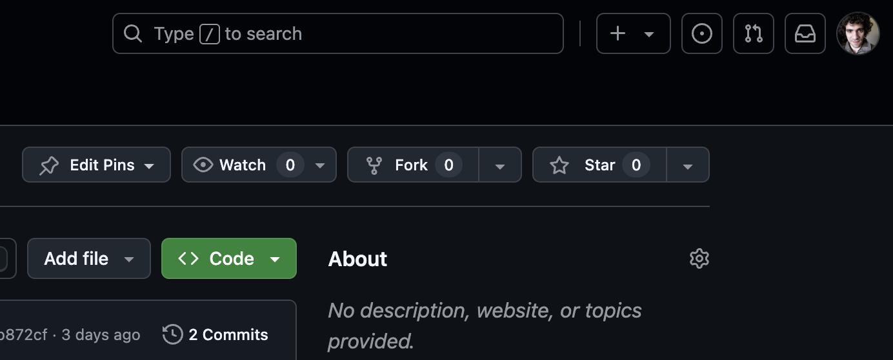
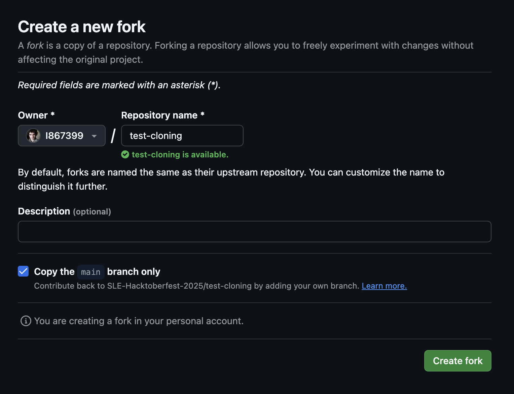
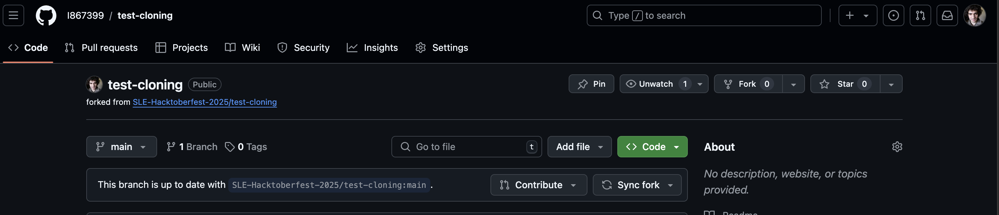
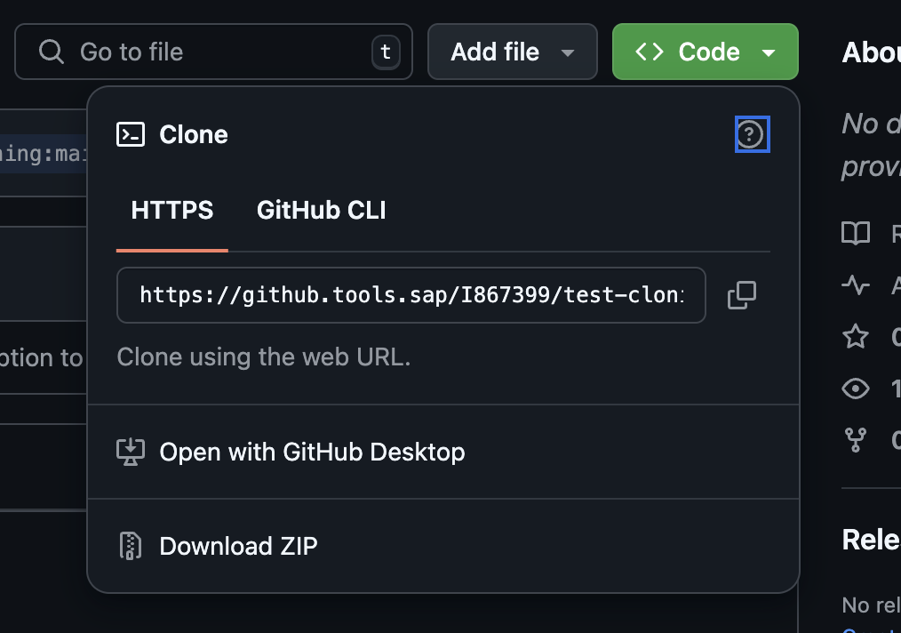
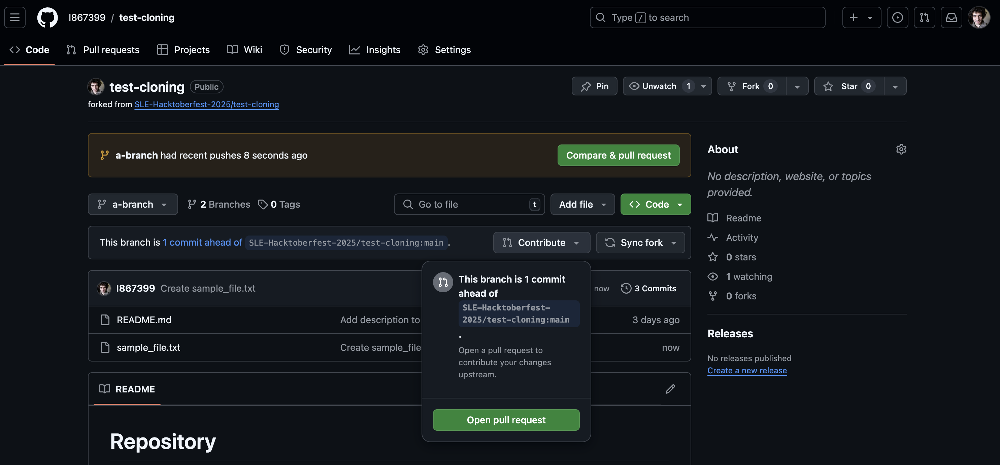
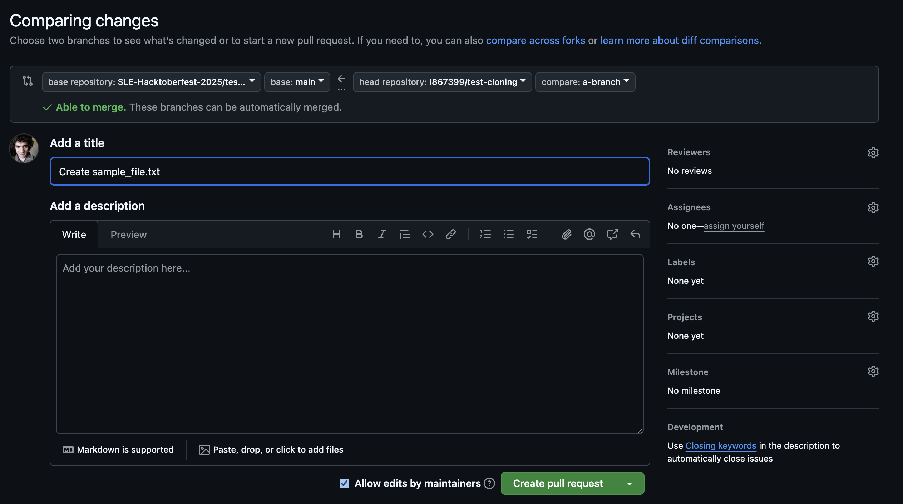

# HacktoberFest Collaborative Vibe Coding Session

Join us for an exciting and collaborative experience at the HacktoberFest, where creativity meets technology in an open and inclusive environment. Our main objective is to bring together diverse groups to showcase their Lines of Business (LoB), projects, or initiatives they are passionate about. This event serves as a platform to foster collaboration, innovation, and the spirit of Open Source.

## Event goals

- **Collaborative Environment:** Engage with fellow participants to share knowledge, ideas, and expertise, creating a supportive and inspiring setting.

- **LoB and Project Presentations:** Each group will have the opportunity to create a dedicated page to present their Line of Business or any project/initiative they are involved in, highlighting their goals and achievements.

- **Open Source Concepts:** Embrace and promote the principles of Open Source, encouraging transparency, community collaboration, and continuous improvement in tech development.

# Coding activity

## Check contribution guidelines

At the root folder of this repository, you will find a CONTRIBUTING.md file.

Read it to understand the guidelines for contributing to this project.

We will follow the guidelines described there, while going through the steps here.

You can also learn more about this file in GLOSSARY.md and FAQ.md.

## Make a fork to your personal space

As described in the CONTRIBUTING.md file, we will use forks to collaborate.

Go to the project's repository and click the "Fork" button on the top right of the page.



In the next screen, make sure the "Owner" is set to your profile, and click on the green "Create fork" button.



## Clone and install your fork to your local machine

While at your fork's page, click on the green "Code" button.



It will open a small popup with the repository's URL.

Either copy the URL, or click on the "Copy to clipboard" button.



In your local machine, using the Terminal, go to an empty folder and run this command, where <REPO_URL> is the content you just copied.

```
git clone <REPO_URL>
```

This will clone your fork to a folder with the same name of the project, under the current folder.

After the cloning it, run these commands to enter the the cloned project directory and install it dependecies:

```
cd <CLONED_PROJECT_NAME>
npm install
```

## Create a branch for your implementation

You can do this in two different ways:

Alternative 1: Inside your local repository folder (the one that was created in the last step, if you are following through), run this command, where <your_branch_name> can be any descriptive name of your choice.

```
git checkout -b <your_inumber>/<your_branch_name>
```

Alternative 2: Open the project folder in VScode and use the IDE terminal to create a branch. Use the same command and follow the same convention of `<your_inumber>/<your_branch_name>`.

## Implement your page

Create a new folder under `src/pages` for your page. Make sure to name it after the content you intend to create, and choose something unique that is unlikely to coincide with other people who might be creating a page for the same area.

Add a route to your page in `src/App.jsx` file. Again, make sure to choose something that is unlikely to conflict with other teams.

Add a link to your page in `src/pages/Home.jsx`. Follow the example of other links already there, under `items`.

Now use your creativity!

Create a page that shows off your LoB, as you would like to present it to the rest of the Labs.

Use Cline to help you.

### Run your project locally

To test the implementation, open a new terminal (can be in VS Code), navigate to you projects directory and run the application in your machine with:

```
npm run dev
```

## Commit your work

Once you are done, and double checked that everything is working fine, make a commit with the code you implemented.

Here is a typical command-line way to do it:

Stage all your changes:

```
git add .
```

Create the commit with those changes. Make sure to include a meaningful, descriptive and concise message that describes what you have implemented!:

```
git commit -m "<Your message here>"
```

## Push your work to your remote fork

Either use VScode, or run the command (remember to use the same name you chose for your branch).

```
git push -u origin <your_inumber>/<your_branch_name>
```

## Open a Pull Request to the original repository

Time to get back to where it all started!

Now, in your fork repository, you might see a new section at the top, with a green "Compare & pull request" button.

You can either use this new button or click on "Contribute" and in the following popup, "Open pull request".



Next, you will be prompted to choose the target of the Pull Request, and to write a title and description for it.

The target should already be correct, but double check that you are targeting the official repository, from the Hacktoberfest organization, and not your fork repository.

The content of `base repository` field should be the repository from the Hacktoberfest organization:



Add a meaningful and concise title and description. Try to write it in a way that will help reviewers understand your contribution and evaluate it efficiently.

Once everything looks good, click the "Create pull request" button.

## Review other people's Pull Requests

While you wait for your Pull Request to be approved, take a look at other people's Pull Requests and review them.

Make sure to follow the guidelines under CONTRIBUTING.md that describe what this project considers a good Pull Request review - try to follow them as well as you can!

If you find any issue with the Pull Request, most importantly if you think it is an issue that will generate errors due to conflicts or in one of the shared files, leave a comment on the Pull Request asking the contributors to fix their code. Leave the comment as close to the problem you identified as possible, to help the contributors finding and fixing it.

If the Pull Request you are reviewing looks good after going through it all, then mark it as approved, so that we know it is in a state ready to be merged.

## Check back the status of your Pull Request

Every few moments, check back the state of your Pull Request to see if any changes have been requested - if so, fix the issues that were identified and push the new code, before asking the previous reviewer to take a look again.

If your Pull Request has been approved but not merged, just wait a few moments - it will be merged soon.

If your Pull Request has been merged, congratulations! You have just contributed to a collaborative project, following best practices and learning a lot about Open Source, InnerSource and vibe coding along the way!

Be sure to celebrate accordingly! :)
